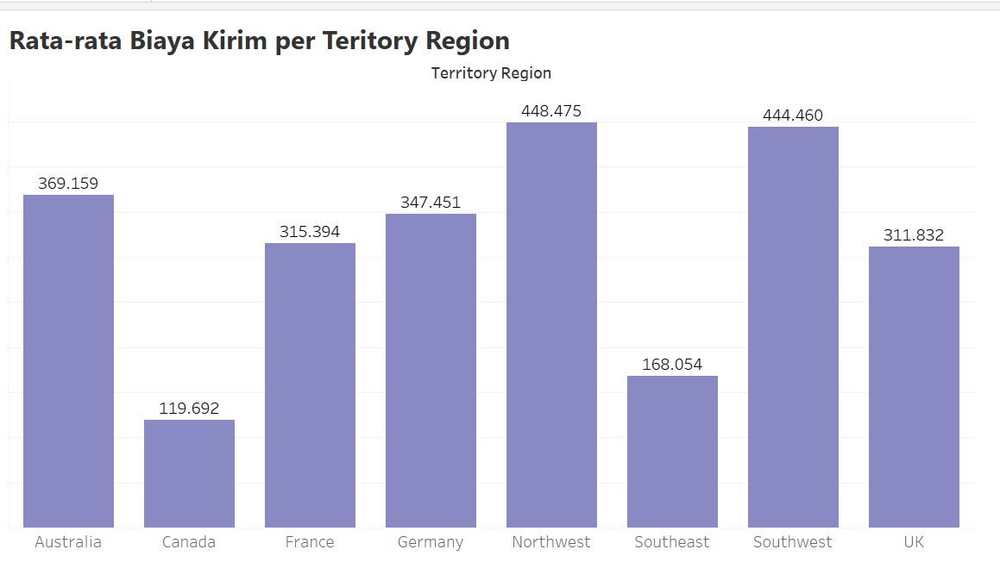
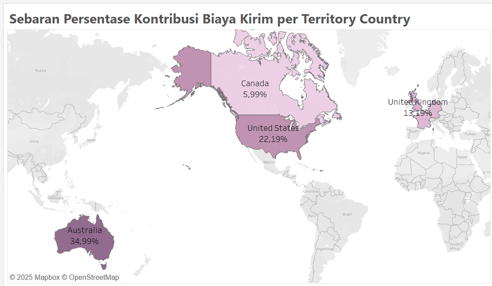
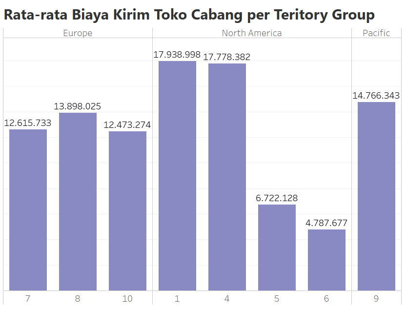
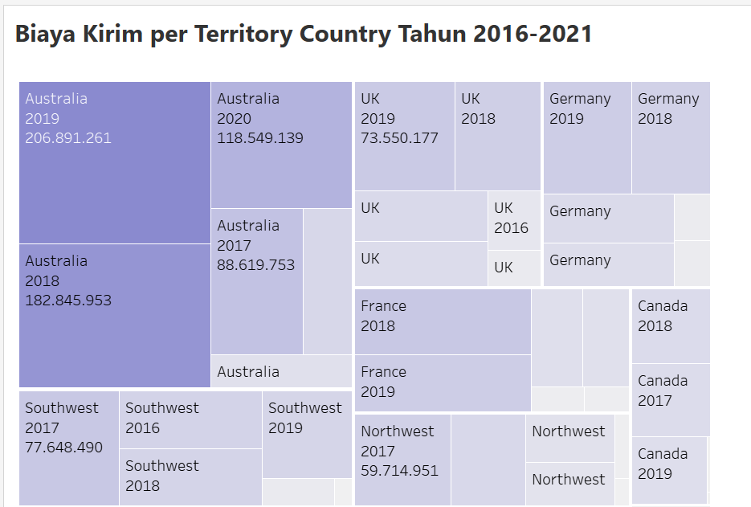
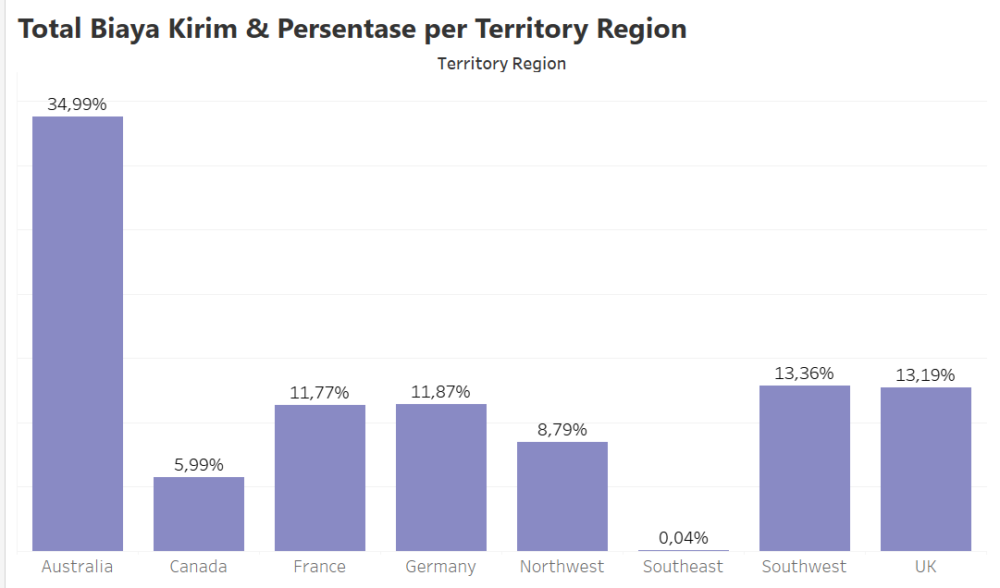

**Objective Analysis** : Melakukan analisis biaya pengiriman lintas wilayah dengan melihat distribusi, rata-rata biaya, serta kontribusi per negara/region. Analisis ini bertujuan untuk mengidentifikasi pola pengiriman, menemukan wilayah dengan beban biaya tertinggi, dan memberikan rekomendasi optimasi distribusi.

**Analisis Bisnis** :

  1. Wilayah mana yang memiliki  rata-rata biaya kirim tertinggi?

        

     **Wawasan** : Rata-rata biaya kirim berdasarkan wilayah teritorial yang paling tinggi adalah di region northwest yaitu sebesar 448.475.
     
     **Pengatahuan yang dapat ditindak lanjuti**: Melakukan optimasi pada jalur distribusi atau gabungkan pengiriman pada region tersebut untuk menekan biaya. Adapun pilihan alternatif yaitu mengidentifikasi lebih lanjut faktor-faktor yang mempengaruhi biaya kirim.

  2. Negara cabang mana yang menyumbang biaya kirim total terbesar?

        

     **Wawasan** : Sebaran persentase kontribusi biaya  kirim berdasarkan negara cabang yaitu negara Australia yang memiliki persentase tertinggi yaitu 34.99%.
     
     **Pengetahuan yang dapat ditindak lanjuti** : Meninjau lebih lanjut mengenai volume dan  frekuensi pengiriman dari/ ke Australia.

  3. Berapa rata-rata biaya pengiriman pada masing-masing toko cabang berdasarkan teritori group?

       

      **Wawasan** : Rata-rata biaya pengiriman per toko cabang di masing-maisng teritory group menunjukkan berbagai variasi, terdapat 2 toko cabang (origin_id 1 & origin_id 4) di North America yang memiliki rata-rata biaya pengiriman yang hampir sama yaitu sekitar 17 juta-an.
     
      **Pengetahuan yang dapat ditindak lanjuti** : Meninjau lebih lanjut penyebab kedua toko cabang yang berada di North America karena memiliki rata-rata biaya pengiriman yang tinggi.

  4. Bagaimana volume  total pengiriman  per wilayah dari tahun 2016-2021?

       

     **Wawasan** : Selama periode 2016-2021, volume total pengiriman menunjukkan dominasi Australia, khususnya pada tahun 2019 dengan nilai tertinggi 206.891.261, dan juga tahun 2018 (182.845.953).
     
     **Pengetahuan yang dapat ditindaklanjuti** : Meninjau kembali faktor yang memengaruhi total biaya kirim di Australia sangat tinggi untuk membuat keputusan strategis yang tepat.

  5. Berapa persentase kontribusi biaya kirim setiap wilayah  terhadap total biaya kirim global?

     

     **Wawasan** : Kontribusi persentase biaya kirim terhadap total biaya kirim global secara signifikan didominasi oleh Australia sebesar 34,99%. Wilayah lain seperti Southwest (13,36%) dan UK (13,19%) menyusul di urutan berikutnya, namun selisihnya cukup jauh dari kontribusi Australia.
     
     **Pengetahuan yang dapat ditindak lanjuti** :	Memantau tren biaya kirim per wilayah dan persentasenya secara berkala untuk mengidentifikasi perubahan atau peluang baru lebih awal.
