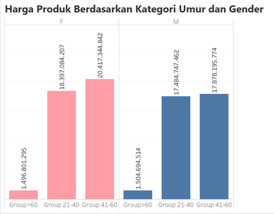

1. Seorang data analyst ingin mengetahui target pelanggan berdasarkan dataset Bee Cycle. Oleh karena itu dibuat visualisasi untuk melihat distribusi pelanggan berdasarkan gender dan umur.  
  -> Kelompok grup umur apa dan gender apa yang memiliki transaksi tertinggi?

    

  **Wawasan**: Customer yang gender Female dengan kategori umur sekitar 41-60 sebagai pelanggan yang memiliki total transaksi tertinggi.
  **Pengetahuan yang dapat ditindak lanjuti**: 

2. Karena bulan oktober depan akan ada campaign, kami ingin menyorot warna produk tertentu yang menjadi kegemaran pelanggan.  
  -> Warna apa di tiap tahun yang menjadi warna paling populer dibeli oleh pelanggan?

    
  **Wawasan** : Selama periode 2016-2019 warna merah menjadi warna yang sering dibeli oleh pelanggan, dan warna hitam menjadi warna yang konsisten dibeli oleh pelanggan selama periode 2016 hingga 2021.
  **Pengetahuan yang dapat ditindak lanjuti** :

3. Karena kampanye untuk bulan Oktober hanya terbatas pada tiap toko cabang, kami hanya ingin mengambil produk populer dari tiap toko cabang.
  -> Top 10 produk apa saja yang paling populer di tiap teritory/origin country?

  **Wawasan** : Water Bottle 30 oz menjadi produk terlaris di Australia dengan total penjualan 124 Unit.
  **Pengathuan yang dapat ditindak lanjuti** : 
    
  
